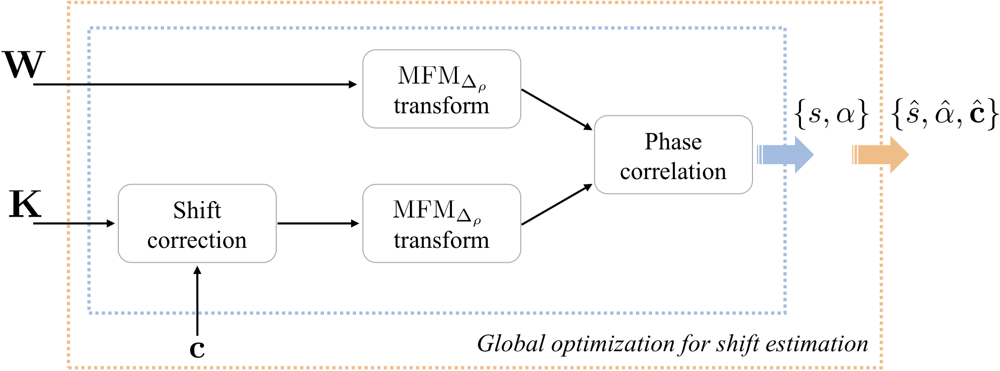
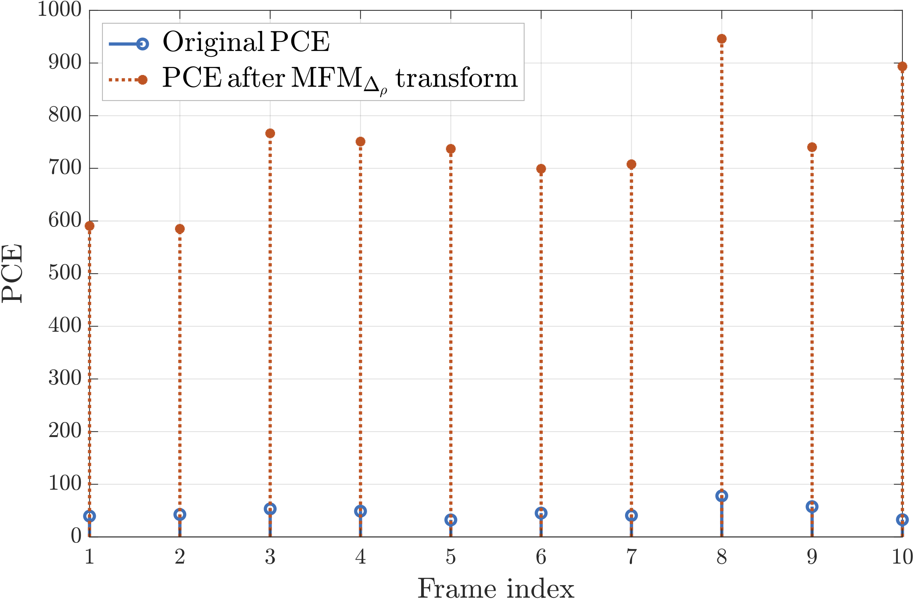

# A Modified Fourier-Mellin Approach for Source Device Identification on Stabilized Videos

This is the official repository of **A Modified Fourier-Mellin Approach for Source Device Identification on Stabilized Videos**, accepted to [IEEE International Conference on Image Processing (ICIP) 2020](https://2020.ieeeicip.org/) pp. 1266-1270 and publicly available on [arXiv](https://arxiv.org/pdf/2005.09984.pdf).

## Code

### Requirements

- Install MATLAB Image Processing Toolbox, Global Optimization Toolbox
- Download the [Camera-fingerprint](http://dde.binghamton.edu/download/camera_fingerprint) package and run the function `compile.m` in folder `CameraFingerprint/Filter`.

### Pipeline

Given a video query and a reference device:
- extract the I-frames from the video
- extract the noise residuals of the I-frames using the Camera-fingerprint package and save them as `test_noises.mat`
- extract the device PRNU using the Camera-fingerprint package, then scale and crop it as suggested in [1]. Save it as `K.mat`
- run the function `MFM_deltarho_main.m` to test the video

### Example result
Run the function `MFM_deltarho_main.m` to evaluate the proposed Modified Fourier Mellin method over a sample query video.  
For this example, the first I-frames of the video named as `D12_V_indoor_move_0001.mp4` have been selected from the Vision dataset [2].
Their noise residuals were saved in `test_noises.mat`. The scaled and cropped PRNU of device `D12` from Vision dataset was saved as `K.mat`.

## References
[1] S. Mandelli, P. Bestagini, L. Verdoliva, S. Tubaro, *Facing device attribution problem for stabilized video sequences*,
IEEE Transactions on Information Forensics and Security 15, pp. 14-27, 2020, old version publicly available on [arXiv](https://arxiv.org/pdf/2005.09984.pdf).

[2] D. Shullani, M. Fontani, M. Iuliani, O. Al Shaya, and A. Piva,
*VISION: a video and image dataset for source identification*. EURASIP Journal on Information Security, 2017(1), p.15, available [here](https://d-nb.info/1147287147/34). 
